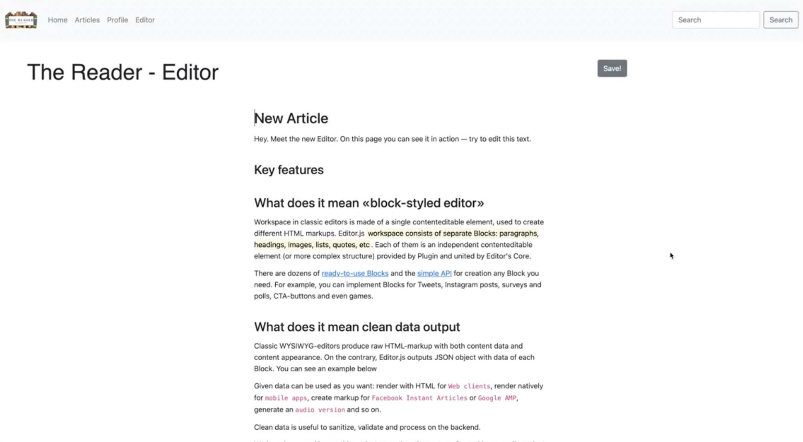
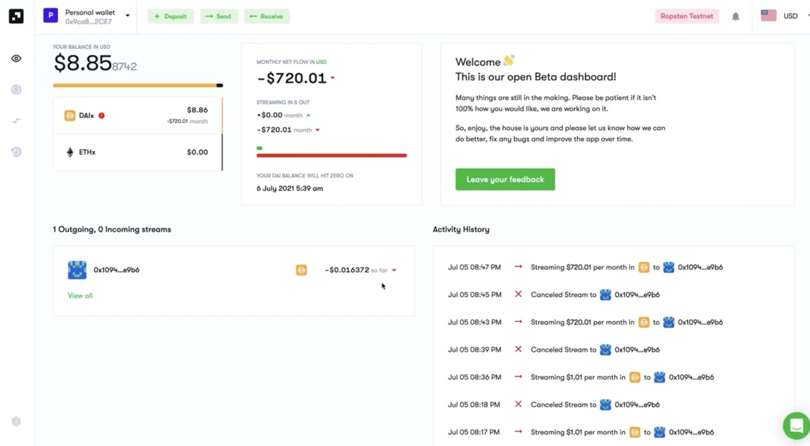

# EthGlobal HackMoney Hackathon - Decentralized Medium

### [Link to showcase: https://showcase.ethglobal.co/hackmoney2021/decentralized-medium](https://showcase.ethglobal.co/hackmoney2021/decentralized-medium)






## Quick start

The first things you need to do are cloning this repository and installing its
dependencies:

```sh
git clone https://github.com/nomiclabs/hardhat-hackathon-boilerplate.git
cd hardhat-hackathon-boilerplate
npm install
```

Once installed, let's run Hardhat's testing network:

```sh
npx hardhat node
```

Then, on a new terminal, go to the repository's root folder and run this to
deploy your contract:

```sh
npx hardhat run scripts/deploy.js --network localhost
```

Finally, we can run the frontend with:

```sh
cd frontend
npm install
npm start
```

> Note: There's [an issue in `ganache-core`](https://github.com/trufflesuite/ganache-core/issues/650) that can make the `npm install` step fail. 
>
> If you see `npm ERR! code ENOLOCAL`, try running `npm ci` instead of `npm install`.

Open [http://localhost:3000/](http://localhost:3000/) to see your Dapp. You will
need to have [Metamask](https://metamask.io) installed and listening to
`localhost 8545`.

